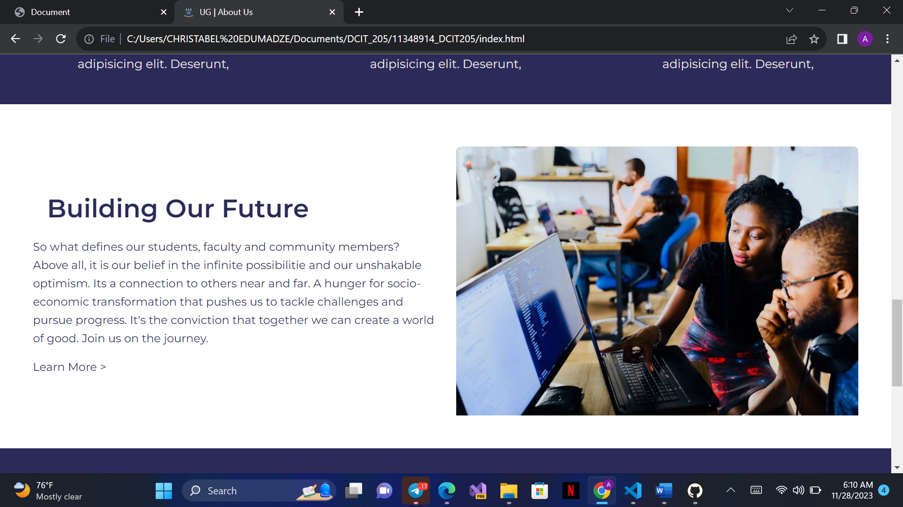

# DCIT_205_IA

# Computer Science Website Project

## Introduction

Welcome to the Computer Science Website Project, a dynamic platform designed to showcase the multifaceted aspects of the Computer Science (CS) department. This project serves as a practical application of class learnings, enhancing research abilities, creativity, and technical skills.

## Pages Overview

1. **Home Page:**
   - Introduction to the CS department, including students, staff, and alumni.
   - Event countdown, inspiring quotes, and additional links in the footer.

2. **Event Page:**
   - Countdown timer for the next event.
   - Details about the webinar, host, and other speakers.
   - Event purpose and information.

3. **Library Page:**
   - Information on 24-hour service, best books, and securing payment.
   - Sections on web development books and programming books.

4. **Contact Us Page:**
   - Contact details, including address, phone numbers, and an embedded map.
   - Form for inquiries and messages.

5. **Student Page:**
   - Undergraduate and postgraduate links.

6. **Undergraduate Page:**
   - Courses combination and details for first and second semesters.

7. **Postgraduate Page:**
   - Details on master's and PhD programs for first and second semesters.

8. **Staff Page:**
   - Information on staff, their offices, and office hours.

9. **Alumni Page:**
   - Overview of alumni donations and future plans.
   - Upcoming programs for alumni.

10. **Student Login Page:**
    - Portal for students to access their content.

## Cloning and Setup Instructions

### Technologies Used
- HTML
- CSS
- JavaScript

### Clone Repository
1. Open your terminal or command prompt.
2. Navigate to the directory where you want to clone the repository.
3. Run the following command to clone the repository:

git clone https://github.com/Araba02/11348914_DCIT205.git

4. This will create a local copy of my repository on my computer.

### Local Setup
1. Once the cloning is complete, open the files using a text editor or an integrated development environment (IDE), such as Visual Studio Code.
2. Make any necessary modifications or view the code.

## Author

Christabel Araba Edumadze  
Student ID: 11348914

## Learning Experience

This project provided valuable insights into web development, GitHub usage, and enhanced creativity. Overcoming challenges through research furthered my understanding of version control and collaborative coding practices.

## Acknowledgments

Special thanks to the supportive faculty, peers, and the CS department for fostering an environment conducive to exploration and learning.

## Screenshots

